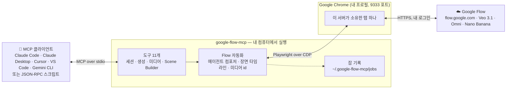
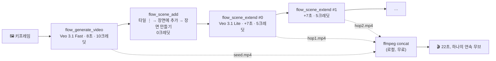

# 🎬 google-flow-mcp

[](https://www.npmjs.com/package/@park-sang-gwon/google-flow-mcp)
[](https://github.com/ParkSangGwon/google-flow-mcp/actions/workflows/ci.yml)
[](LICENSE)


[English](README.md) | **한국어**

AI 어시스턴트가 **Google Flow**(Veo, Nano Banana)로 영상을 만들고, **Scene Builder(장면 빌더)** 로 이어 붙여 길고 끊김 없는 롱테이크를 완성하게 해 주는 MCP 서버입니다. 말로 시키면 됩니다.

> - "이 키프레임으로 8초 세로 클립 만들어 줘: 새벽 돌담 위에서 우는 수탉."
> - "그 클립을 장면에 넣고 두 번 확장해 — 천천히 밀고 들어가다가 카메라가 하늘로 떠오르게."
> - "구리 풍향계 포스터 이미지 9:16으로 세 장, Nano Banana로."
> - "지금 Flow 화면이 어떻게 보이는지 보여 줘." (`flow_inspect` / `flow_screenshot`)

[Model Context Protocol(MCP)](https://modelcontextprotocol.io) 서버이며 **내 Chrome 세션**으로 Flow를 구동합니다. Claude Code, Claude Desktop, Cursor, VS Code, Gemini CLI 등 모든 MCP 클라이언트와 순수 JSON-RPC 스크립트에서 쓸 수 있습니다.

## ❌ 없을 때 / ✅ 있을 때

| ❌ 없을 때                                    | ✅ google-flow-mcp                                                                 |
| --------------------------------------------- | ---------------------------------------------------------------------------------- |
| Flow에는 공개 API가 없어 클립마다 손으로 클릭 | 에이전트가 `flow_generate_video`를 부르면 렌더를 기다렸다가 파일 경로를 돌려줌     |
| Veo 클립은 8초가 한계                         | `flow_scene_extend`가 7초씩 모션**과 오디오**를 이어서 확장(이음새 NCC 0.99 실측)  |
| 클릭 한 번 잘못하면 크레딧이 나감             | 생성 도구마다 **드라이런**(`auto_confirm: false`)이 있어 클릭 직전에 멈춤          |
| 렌더 도중 죽으면 작업을 잃음                  | 잡 기록이 디스크에 남아 `resume: true`로 진행 중인 생성을 이어받음(이중 과금 없음) |
| UI가 바뀌면 스크래퍼가 조용히 깨짐            | `flow_inspect`가 실제 화면을 에이전트에게 보여 줘 라벨 변경은 한 줄 수정으로 끝    |

## 🏗️ 구조



Chrome은 Playwright **밖에서** 띄웁니다(그래야 Google 로그인이 자동화 브라우저로 거부하지 않음). 전용 프로필이 로그인을 유지하고, 서버는 비밀번호를 보지 않으며, 프롬프트는 쓴 그대로 Flow에 전달되고, 다운로드는 브라우저의 인증된 세션을 통해 돌아옵니다.

## ✨ 기능

- 🎥 **영상 생성** — Flow 에이전트 컴포저로 Veo 3.1 Lite / Fast / Quality, Omni Flash, 4~10초, 9:16·16:9, 키프레임을 첫 프레임으로
- 🖼️ **이미지 생성** — Nano Banana Pro / 2 / 2 Lite, Flow의 모든 비율, 참조 이미지
- 🧩 **Scene Builder** — 클립으로 장면 만들기, 타임라인 읽기, 마지막 클립을 7초씩 확장(모션·환경음 연속)
- 🧪 **드라이런**과 **멱등 재시도** — 같은 확장을 두 번 요청하면 파일만 돌려주고 두 번 과금하지 않음
- 💾 **크래시 안전** — 긴 렌더는 잡 파일로 추적, 재시작·타임아웃 뒤 `resume: true`로 마무리
- 🔍 **UI 검사**(`flow_inspect`) — 실제 페이지의 스냅샷/diff, 텍스트 검색, 미디어 타일 위치, 네트워크 관찰
- 🧾 **구조화된 결과** — `{ ok, code, message, details }`, 메시지 문자열이 아니라 코드로 분기
- 🩺 **`doctor`** — Chrome·포트·로그인 점검, 연결을 막는 멈춘 탭 탐지
- 🇰🇷 🇺🇸 한국어·영어 Flow UI 라벨 기본 지원(다른 언어는 파일 하나에 추가)

## 🚀 빠른 시작

### 요구사항

| 무엇                                      | 왜                                                        |
| ----------------------------------------- | --------------------------------------------------------- |
| **Node.js 20+**                           | 서버 실행(`node --version`)                               |
| **Google Chrome**                         | 자동화 대상. macOS 경로가 기본값, 그 외는 설정으로        |
| **Flow 접근 가능한 Google 계정 + 크레딧** | 생성은 직접 Generate를 누르는 것과 똑같이 크레딧을 씁니다 |

### 1️⃣ 클라이언트에 서버 등록

<details open>
<summary><b>Claude Code</b></summary>

```bash
claude mcp add google-flow -- npx -y @park-sang-gwon/google-flow-mcp
```

</details>

<details>
<summary><b>Claude Desktop</b></summary>

`claude_desktop_config.json` → `mcpServers`:

```json
{
  "mcpServers": {
    "google-flow": { "command": "npx", "args": ["-y", "@park-sang-gwon/google-flow-mcp"] }
  }
}
```

</details>

<details>
<summary><b>Cursor</b></summary>

`~/.cursor/mcp.json`(또는 프로젝트의 `.cursor/mcp.json`):

```json
{
  "mcpServers": {
    "google-flow": { "command": "npx", "args": ["-y", "@park-sang-gwon/google-flow-mcp"] }
  }
}
```

</details>

<details>
<summary><b>VS Code (Copilot 에이전트 모드)</b></summary>

`.vscode/mcp.json`:

```json
{
  "servers": {
    "google-flow": { "type": "stdio", "command": "npx", "args": ["-y", "@park-sang-gwon/google-flow-mcp"] }
  }
}
```

</details>

<details>
<summary><b>Gemini CLI</b></summary>

`~/.gemini/settings.json`:

```json
{
  "mcpServers": {
    "google-flow": { "command": "npx", "args": ["-y", "@park-sang-gwon/google-flow-mcp"] }
  }
}
```

</details>

<details>
<summary><b>클론해서 쓰기(개발)</b></summary>

```bash
git clone https://github.com/ParkSangGwon/google-flow-mcp && cd google-flow-mcp
npm install && npm run build
claude mcp add google-flow -- node "$PWD/dist/cli.js"
```

</details>

### 2️⃣ 한 번만 로그인

```bash
npx -y @park-sang-gwon/google-flow-mcp doctor
```

첫 실행이 전용 Chrome(`~/.google-flow-chrome`)을 띄웁니다. **그 창에서** Google에 한 번 로그인하면 `doctor`가 `flow: logged in`을 보고합니다. 이후 서버는 그 프로필을 재사용하며, Chrome이 특이한 위치에 있지 않다면 설정할 것이 없습니다([설정](#️-설정) 참고).

### 3️⃣ 써 보기

어시스턴트에게 Flow 프로젝트를 열고 **크레딧 없이** 영상을 준비하게 해 보세요.

> "https://flow.google.com/project/… 를 `flow_project_open`으로 열고, `auto_confirm: false`로 `flow_generate_video`를 불러 … 의 8초 9:16 클립을 준비해 줘"

`status: "ready_for_confirmation"`과 스크린샷 경로가 옵니다. "진행해"라고 하면 에이전트가 `auto_confirm: true`로 같은 호출을 반복합니다.

## 🎥 생성은 어떻게 동작하나

```mermaid
sequenceDiagram
    autonumber
    participant A as 🤖 에이전트
    participant S as google-flow-mcp
    participant B as Chrome 탭
    participant F as ☁️ Google Flow

    A->>S: flow_generate_video {prompt, model, reference_images, auto_confirm}
    S->>B: 프로젝트 열기 · 새 에이전트 세션 · 설정(비율, 개수, 모델, "생성 전 확인: 안 함")
    S->>B: 키프레임 첨부 → 썸네일 확인 (없으면 REFERENCE_NOT_ATTACHED, 전송 안 함)
    S->>B: 지시문 입력
    alt auto_confirm = false
        S-->>A: status: ready_for_confirmation + 스크린샷 (0크레딧)
    else auto_confirm = true
        S->>S: 잡 기록(타일 수 기준선) 저장
        S->>B: 전송(Enter) → 승인 카드 / 정책 거절 처리
        B->>F: 생성
        loop 6초마다, 최대 30분
            S->>B: 타일 수가 기준선보다 늘었나?
        end
        F-->>B: 클립 완성
        S->>B: 인증된 GET flow.google.com/asb/&lt;token&gt;
        S-->>A: status: completed, files[], media_ids[], job_id
    end
```

루프 도중 서버가 죽거나 타임아웃되면 같은 도구를 `resume: true`로 다시 부르세요. 잡을 다시 읽어 컴포저를 건너뛰고 대기·다운로드만 합니다.

## 🧩 Scene Builder: 끊김 없는 롱테이크

Flow의 Scene Builder는 클립의 마지막 프레임들을 분석해 다음 장면을 생성하며 모션과 환경음을 이어 줍니다. 이 서버는 그 경로 전체를 자동화합니다.



실제 UI에서 측정한 값(2026년 9월, 자세한 내용은 [docs/scene-builder.md](docs/scene-builder.md)):

| 항목            | 값                                                                                 |
| --------------- | ---------------------------------------------------------------------------------- |
| 확장 길이       | hop당 7.0초, 오디오 포함 별도 MP4(9:16 시드면 720×1280)                            |
| 이음새          | hop의 첫 프레임 == 직전 클립의 마지막 프레임(NCC 0.995~0.998), 겹침 없음           |
| 모델            | Flow가 Veo 3.1 - Lite로 고정(Ultra 기준 hop당 5크레딧)                             |
| 승인 카드       | 없음                                                                               |
| 재시도 / 크래시 | `already_exists`가 기존 hop을 돌려줌, `resume: true`가 크래시 뒤 렌더된 hop을 회수 |

> [!TIP]
> hop 프롬프트마다 피사체·의상·조명·카메라 무브를 다시 적어 주세요. Flow는 이전 프롬프트를 이어받지 않습니다.

레시피:

```text
seed  = flow_generate_video { model: "veo-3.1-fast", duration: 8, reference_images: ["/abs/keyframe.jpg"], ... auto_confirm: true }
scene = flow_scene_add     { project_url, media_id: seed.media_ids[0] }
hop1  = flow_scene_extend  { scene_url: scene.scene_url, prompt: "…이어서…", after_clip_index: 0, output_dir, auto_confirm: true }
hop2  = flow_scene_extend  { ..., after_clip_index: 1, ... }
ffmpeg -i seed.mp4 -i hop1.mp4 -i hop2.mp4 -filter_complex "[0:v][0:a][1:v][1:a][2:v][2:a]concat=n=3:v=1:a=1" take.mp4
```

## 🔧 도구

| 그룹             | 도구                  | 하는 일                                                           | 크레딧 |
| ---------------- | --------------------- | ----------------------------------------------------------------- | :----: |
| 🔌 세션          | `flow_connect`        | Chrome에 붙거나 띄우고 Flow를 열어 `logged_in` 보고               |   –    |
|                  | `flow_status`         | 연결·로그인·현재 프로젝트/장면·실행 중 도구·진행 중 잡            |   –    |
|                  | `flow_screenshot`     | 소유 탭의 PNG                                                     |   –    |
|                  | `flow_inspect`        | 스냅샷 → 액션 → UI diff; 텍스트 검색, 미디어 타일, 네트워크       |   –    |
|                  | `flow_project_open`   | 프로젝트 열고 미디어 id 목록                                      |   –    |
| 🎥 생성          | `flow_generate_video` | Veo 3.1 Lite/Fast/Quality, Omni Flash; 키프레임; 드라이런; resume |   ✅   |
|                  | `flow_generate_image` | Nano Banana Pro / 2 / 2 Lite; 1~4장; 참조; 드라이런; resume       |   ✅   |
| 💾 미디어        | `flow_media_download` | 로그인 세션으로 미디어 id 다운로드                                |   –    |
| 🧩 Scene Builder | `flow_scene_add`      | 클립으로 장면 생성 → `scene_url`                                  |   –    |
|                  | `flow_scene_status`   | 장면의 클립·길이·미디어 id                                        |   –    |
|                  | `flow_scene_extend`   | 마지막 클립을 7초 확장(Veo 3.1 Lite); 멱등; resume                |   ✅   |

입출력 스키마 전체: [docs/tools.md](docs/tools.md)(코드에서 생성되어 항상 일치).

## 🧾 결과와 오류

모든 도구는 JSON 텍스트 블록 하나로 답합니다.

```jsonc
// 성공
{ "ok": true, "status": "completed", "files": ["/abs/out/flow_ab12cd34_job.mp4"], "media_ids": ["ab12cd34"], "job_id": "mtk0…" }
// 실패 (isError: true) — 예외로 던지지 않고 항상 구조화
{ "ok": false, "code": "REFERENCE_NOT_ATTACHED", "message": "0/1 reference images attached; nothing was sent", "recoverable": false, "details": {}, "screenshot": "/…/reference-not-attached.png" }
```

| 코드                     | 의미                                                 | 재시도?                    |
| ------------------------ | ---------------------------------------------------- | -------------------------- |
| `NOT_LOGGED_IN`          | Chrome이 Google 로그인 페이지에 있음                 | 먼저 로그인                |
| `REFERENCE_NOT_ATTACHED` | 키프레임이 컴포저에 안 붙어 전송하지 않음            | 경로 확인                  |
| `POLICY_BLOCKED`         | Flow가 프롬프트를 거절                               | 프롬프트 수정              |
| `GENERATION_TIMEOUT`     | `generationTimeoutMs` 안에 결과 없음                 | `resume: true`             |
| `BUSY`                   | 다른 도구 호출이 이 서버의 탭을 쓰는 중              | 잠시 후 재시도             |
| `UI_NOT_FOUND`           | 버튼/메뉴가 예상 위치에 없음(`details`에 본 것 기록) | 문제 해결 절 참고          |
| `CLIP_NOT_FOUND`         | `after_clip_index`가 마지막 클립이 아님              | `flow_scene_status`로 확인 |

## 💳 크레딧 (Google AI Ultra, 2026년 9월 — 본인 요금제에서 확인)

| 모델                     | 크레딧            | 비고                                     |
| ------------------------ | ----------------- | ---------------------------------------- |
| Veo 3.1 - Lite           | 5 (4/6/8초)       | Scene Builder Extend가 쓰는 유일한 모델  |
| Veo 3.1 - Fast           | 10                |                                          |
| Veo 3.1 - Quality        | 100               |                                          |
| Omni Flash               | 15 / 20 / 25 / 30 | 4 / 6 / 8 / 10초; video-to-video 편집 40 |
| Scene Builder Extend 1회 | 5                 | 7초, Veo 3.1 - Lite                      |

## ⚙️ 설정

macOS에서는 기본값으로 동작합니다. `~/.config/google-flow-mcp/config.json`(`npx -y @park-sang-gwon/google-flow-mcp init`이 생성)이나 `FLOW_MCP_*` 환경변수로 바꿉니다.

| 키                    | 환경변수                         | 기본값                                                         |
| --------------------- | -------------------------------- | -------------------------------------------------------------- |
| `chromePath`          | `FLOW_MCP_CHROME_PATH`           | `/Applications/Google Chrome.app/Contents/MacOS/Google Chrome` |
| `userDataDir`         | `FLOW_MCP_USER_DATA_DIR`         | `~/.google-flow-chrome`                                        |
| `cdpPort`             | `FLOW_MCP_CDP_PORT`              | `9333`                                                         |
| `stateDir`            | `FLOW_MCP_STATE_DIR`             | `~/.google-flow-mcp` (로그·스크린샷·잡)                        |
| `generationTimeoutMs` | `FLOW_MCP_GENERATION_TIMEOUT_MS` | `1800000`                                                      |
| `logLevel`            | `FLOW_MCP_LOG_LEVEL`             | `info`                                                         |

<details>
<summary><b>🐍 MCP 라이브러리 없이 Python(또는 아무 프로세스)에서 쓰기</b></summary>

서버는 stdio 위의 MCP를 말하므로, 순수 JSON-RPC 클라이언트는 40줄이면 됩니다.

```python
import json, subprocess, itertools
proc = subprocess.Popen(["npx", "-y", "@park-sang-gwon/google-flow-mcp"], stdin=subprocess.PIPE, stdout=subprocess.PIPE, text=True, bufsize=1)
ids = itertools.count(1)
def rpc(method, params=None, notify=False):
    msg = {"jsonrpc": "2.0", "method": method, "params": params or {}}
    if not notify: msg["id"] = next(ids)
    proc.stdin.write(json.dumps(msg) + "\n"); proc.stdin.flush()
    if notify: return None
    for line in proc.stdout:
        if line.startswith("{") and json.loads(line).get("id") == msg["id"]:
            return json.loads(line)["result"]
rpc("initialize", {"protocolVersion": "2024-11-05", "capabilities": {}, "clientInfo": {"name": "me", "version": "0"}})
rpc("notifications/initialized", notify=True)
res = rpc("tools/call", {"name": "flow_status", "arguments": {}})
print(json.loads(res["content"][0]["text"]))
```

stdout에는 JSON-RPC 프레임만 쓰이고, 로그는 stderr와 `~/.google-flow-mcp/logs`로 갑니다.

</details>

## 🩺 문제 해결

| 증상                                                  | 조치                                                                                                                                                |
| ----------------------------------------------------- | --------------------------------------------------------------------------------------------------------------------------------------------------- |
| `NOT_LOGGED_IN` / `logged_in: false`                  | 서버가 띄운 Chrome 창에서 한 번 로그인한 뒤 `flow_connect`를 다시 호출                                                                              |
| `BROWSER_NOT_CONNECTED: CDP connect failed … Timeout` | 렌더러가 멈춘 탭 하나가 모두의 Playwright 연결을 막습니다. `npx -y @park-sang-gwon/google-flow-mcp doctor`로 멈춘 탭을 찾고 `--close-hung`으로 닫기 |
| `details`에 rows가 담긴 `UI_NOT_FOUND`                | Flow의 라벨이 바뀐 것. rows를 `src/flow/labels.ts`와 비교해 새 문자열(한국어/영어)을 추가하고 PR 🙏                                                 |
| `REFERENCE_NOT_ATTACHED`                              | 경로는 절대 경로이고 이 컴퓨터에 있어야 합니다. 큰 PNG는 업로드가 느리니 JPEG가 빠름                                                                |
| 에이전트가 "만들겠다"고만 하고 생성하지 않음          | 서버가 두 번 재촉합니다. 그래도 멈추면 설정의 "생성 전 확인"이 "안 함"이 아닌 것 — 도구를 다시 실행                                                 |
| 한 컴퓨터에서 에이전트 둘                             | 괜찮습니다. 서버마다 공유 Chrome의 탭 하나씩을 소유합니다. `output_dir`만 분리하세요                                                                |

로그: `~/.google-flow-mcp/logs/server-YYYY-MM-DD.log` · 단계·실패마다 스크린샷: `~/.google-flow-mcp/screenshots/`.

## ❓ 자주 묻는 질문

**Google 공식 제품인가요?** 아니요. Flow 웹 UI의 비공식 자동화이며 비공개 API를 쓰지 않고, 같은 브라우저에서 손으로 할 수 없는 일은 하지 않습니다.

**Google 비밀번호를 저장하나요?** 절대 아닙니다. Chrome 안에서 로그인하고 세션은 Chrome 프로필 디렉토리에 남습니다. `~/.google-flow-chrome`을 비밀번호 저장소처럼 다루세요.

**Scene Builder의 완성 장면을 다운로드할 수 있나요?** 현재 Flow 빌드에서는 안 됩니다 — 내보내기는 렌더되지만 자동화된 탭으로 파일이 오지 않습니다. 클립을 `media_id`로 받아 로컬에서 concat하세요(이음새는 프레임 단위로 정확합니다).

**"Jump to"는 어디 있나요?** 현재 Scene Builder 메뉴에는 "클립 추가"와 "확장"만 있어 자동화할 대상이 없습니다.

**어떤 Flow UI 언어가 되나요?** 한국어·영어를 매칭합니다. 다른 언어는 `src/flow/labels.ts`에 문자열이 필요하며, `flow_inspect`가 화면의 문자열을 그대로 보여 줍니다.

## 🗺️ 로드맵

- 기존 장면에 클립 추가(애셋 선택기)
- Flow가 자동화 탭에 파일을 주게 되면 장면 내보내기
- 캐릭터와 Tools 갤러리
- 더 많은 UI 언어

## 🤝 기여

```bash
npm install
npm run check   # 포맷 · 린트 · 타입체크 · 단위+stdio 계약 테스트 · 문서 신선도
npm run build
npx tsx scripts/call.ts flow_status         # 도구 하나를 실제 stdio로 실행
```

`flow_inspect` 탐색 루프는 [docs/development.md](docs/development.md), 설계는 [docs/architecture.md](docs/architecture.md)를 보세요. Flow를 건드리는 라이브 테스트는 `FLOW_E2E=1` 뒤에 있습니다. [Conventional Commits](https://www.conventionalcommits.org/)를 따라 주세요([CONTRIBUTING.md](CONTRIBUTING.md)).

## 📄 라이선스

MIT. Google Flow, Veo, Nano Banana는 Google LLC의 상표이며 이 프로젝트는 Google의 보증이나 제휴와 무관합니다.
