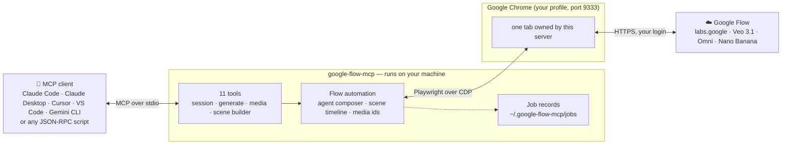
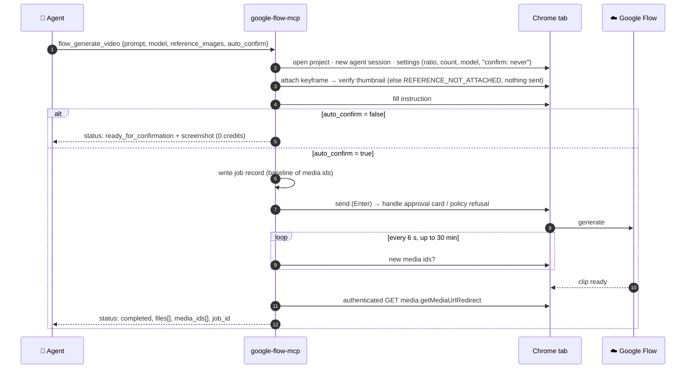

# 🎬 google-flow-mcp

[](https://www.npmjs.com/package/@park-sang-gwon/google-flow-mcp)
[](https://github.com/ParkSangGwon/google-flow-mcp/actions/workflows/ci.yml)
[](LICENSE)


**English** | [한국어](README.ko.md)

Let your AI assistant make videos in **Google Flow** (Veo, Nano Banana) — and stitch them into long, seamless takes with **Scene Builder** — in plain language:

> - "Generate an 8-second vertical clip from this keyframe: a rooster crowing on a stone wall at dawn."
> - "Add it to a scene and extend it twice — keep the slow push-in going, then let the camera rise into the sky."
> - "Make three 9:16 poster images of a copper weathervane with Nano Banana."
> - "Show me what the Flow page looks like right now." (`flow_inspect` / `flow_screenshot`)

This is a [Model Context Protocol (MCP)](https://modelcontextprotocol.io) server that drives Google Flow through **your own Chrome session**. It works with Claude Code, Claude Desktop, Cursor, VS Code, Gemini CLI — any MCP client — and with plain JSON-RPC scripts.

## ❌ Without / ✅ With

| ❌ Without                                                   | ✅ With google-flow-mcp                                                                              |
| ------------------------------------------------------------ | ---------------------------------------------------------------------------------------------------- |
| Flow has no public API; every clip is a manual click session | Your agent calls `flow_generate_video`, waits for the render and gets the file path back             |
| Veo clips are capped at 8 seconds                            | `flow_scene_extend` adds 7-second hops with continuous motion **and audio** (measured seam NCC 0.99) |
| One wrong click spends credits                               | Every generating tool has a **dry run** (`auto_confirm: false`) that stops right before the click    |
| A crash mid-render loses track of the job                    | Job records on disk let `resume: true` pick a running generation up instead of paying twice          |
| UI changes break scrapers silently                           | `flow_inspect` shows the agent the live UI so a changed label is a one-line fix                      |

## 🏗️ Architecture



Chrome is launched **outside** Playwright (so Google's sign-in accepts it) with a dedicated profile that keeps your login. The server never sees a password; prompts go to Flow exactly as you wrote them; downloads come back through the browser's own authenticated session.

## ✨ Features

- 🎥 **Video generation** through the Flow agent composer — Veo 3.1 Lite / Fast / Quality and Omni Flash, 4–10 s, 9:16 or 16:9, with a keyframe as first frame
- 🖼️ **Image generation** with Nano Banana Pro / 2 / 2 Lite, any Flow aspect ratio, reference images
- 🧩 **Scene Builder**: create a scene from a clip, read its timeline, extend the last clip by 7-second hops that continue motion and ambient audio
- 🧪 **Dry runs** for every credit-spending tool, and **idempotent retries** — asking for the same extension twice returns the file, not a second bill
- 💾 **Crash-safe**: long renders are tracked in job files; `resume: true` finishes them after a restart or timeout
- 🔍 **UI inspection** (`flow_inspect`): snapshot/diff of the live page, text search, media tile positions, network watch
- 🧾 **Structured results**: `{ ok, code, message, details }` — clients branch on error codes, never on message text
- 🩺 **`doctor`** checks Chrome, the port, your login and finds hung tabs that would block connections
- 🇰🇷 🇺🇸 Korean and English Flow UI labels out of the box (add yours in one file)

## 🚀 Quick start

### Requirements

| What                                            | Why                                                                   |
| ----------------------------------------------- | --------------------------------------------------------------------- |
| **Node.js 20+**                                 | runs the server (`node --version`)                                    |
| **Google Chrome**                               | the automation target; macOS path is the default, others via config   |
| **A Google account with Flow access + credits** | generations cost Flow credits exactly like clicking Generate yourself |

### 1️⃣ Register the server in your client

<details open>
<summary><b>Claude Code</b></summary>

```bash
claude mcp add google-flow -- npx -y @park-sang-gwon/google-flow-mcp
```

</details>

<details>
<summary><b>Claude Desktop</b></summary>

`claude_desktop_config.json` → `mcpServers`:

```json
{
  "mcpServers": {
    "google-flow": { "command": "npx", "args": ["-y", "@park-sang-gwon/google-flow-mcp"] }
  }
}
```

</details>

<details>
<summary><b>Cursor</b></summary>

`~/.cursor/mcp.json` (or project `.cursor/mcp.json`):

```json
{
  "mcpServers": {
    "google-flow": { "command": "npx", "args": ["-y", "@park-sang-gwon/google-flow-mcp"] }
  }
}
```

</details>

<details>
<summary><b>VS Code (Copilot agent mode)</b></summary>

`.vscode/mcp.json`:

```json
{
  "servers": {
    "google-flow": { "type": "stdio", "command": "npx", "args": ["-y", "@park-sang-gwon/google-flow-mcp"] }
  }
}
```

</details>

<details>
<summary><b>Gemini CLI</b></summary>

`~/.gemini/settings.json`:

```json
{
  "mcpServers": {
    "google-flow": { "command": "npx", "args": ["-y", "@park-sang-gwon/google-flow-mcp"] }
  }
}
```

</details>

<details>
<summary><b>From a clone (development)</b></summary>

```bash
git clone https://github.com/ParkSangGwon/google-flow-mcp && cd google-flow-mcp
npm install && npm run build
claude mcp add google-flow -- node "$PWD/dist/cli.js"
```

</details>

### 2️⃣ Sign in once

```bash
npx -y @park-sang-gwon/google-flow-mcp doctor
```

The first run launches a dedicated Chrome (`~/.google-flow-chrome`). Sign in to Google **in that window** — once. `doctor` then reports `flow: logged in`. From now on the server reuses that profile; there is nothing to configure unless Chrome is somewhere unusual (see [Configuration](#️-configuration)).

### 3️⃣ Try it

Ask your assistant to open a Flow project and prepare a video **without spending credits**:

> "Call `flow_project_open` on https://labs.google/fx/tools/flow/project/… then `flow_generate_video` with `auto_confirm: false` for an 8-second 9:16 clip of …"

You get `status: "ready_for_confirmation"` and a screenshot path. Say "go ahead" and the agent repeats the call with `auto_confirm: true`.

## 🎥 How a generation works



If the server dies or times out during the loop, call the same tool again with `resume: true` — it reloads the job, skips the composer and only waits/downloads.

## 🧩 Scene Builder: long, seamless takes

Flow's Scene Builder extends a clip by analysing its last frames and generating what happens next, keeping motion and ambient sound. This server automates the whole path:

```mermaid
flowchart LR
    K["🖼️ keyframe"] --> V["flow_generate_video<br/>Veo 3.1 Fast · 8 s · 10 credits"]
    V --> A["flow_scene_add<br/>tile ⋮ → Add to Scene → Create scene<br/>0 credits"]
    A --> E1["flow_scene_extend #0<br/>Veo 3.1 Lite · +7 s · 5 credits"]
    E1 --> E2["flow_scene_extend #1<br/>+7 s · 5 credits"]
    E2 --> N["…"]
    V -. seed.mp4 .-> X["ffmpeg concat<br/>(local, free)"]
    E1 -. hop1.mp4 .-> X
    E2 -. hop2.mp4 .-> X
    X --> O["🎬 22 s take, one continuous motion"]
```

What we measured on the live UI (September 2026, details in [docs/scene-builder.md](docs/scene-builder.md)):

| Fact             | Value                                                                                           |
| ---------------- | ----------------------------------------------------------------------------------------------- |
| Extension length | 7.0 s per hop, separate MP4 with audio (720×1280 for a 9:16 seed)                               |
| Seam             | first frame of the hop == last frame of the previous clip (NCC 0.995–0.998), no overlap         |
| Model            | fixed to Veo 3.1 - Lite by Flow (5 credits per hop on Ultra)                                    |
| Approval card    | none                                                                                            |
| Retry / crash    | `already_exists` returns the existing hop; `resume: true` recovers a hop rendered after a crash |

> [!TIP]
> Restate the subject, wardrobe, light and camera move in every hop prompt — Flow does not carry the previous prompt over.

Recipe:

```text
seed  = flow_generate_video { model: "veo-3.1-fast", duration: 8, reference_images: ["/abs/keyframe.jpg"], ... auto_confirm: true }
scene = flow_scene_add     { project_url, media_id: seed.media_ids[0] }
hop1  = flow_scene_extend  { scene_url: scene.scene_url, prompt: "…continues…", after_clip_index: 0, output_dir, auto_confirm: true }
hop2  = flow_scene_extend  { ..., after_clip_index: 1, ... }
ffmpeg -i seed.mp4 -i hop1.mp4 -i hop2.mp4 -filter_complex "[0:v][0:a][1:v][1:a][2:v][2:a]concat=n=3:v=1:a=1" take.mp4
```

## 🔧 Tools

| Group            | Tool                  | What it does                                                           | Credits |
| ---------------- | --------------------- | ---------------------------------------------------------------------- | :-----: |
| 🔌 Session       | `flow_connect`        | Attach to / launch Chrome, open Flow, report `logged_in`               |    –    |
|                  | `flow_status`         | Connection, login, current project/scene, running tool, in-flight jobs |    –    |
|                  | `flow_screenshot`     | PNG of the owned tab                                                   |    –    |
|                  | `flow_inspect`        | Snapshot → action → diff of the UI; text search, media tiles, network  |    –    |
|                  | `flow_project_open`   | Open a project, list its media ids                                     |    –    |
| 🎥 Generate      | `flow_generate_video` | Veo 3.1 Lite/Fast/Quality, Omni Flash; keyframe; dry run; resume       |   ✅    |
|                  | `flow_generate_image` | Nano Banana Pro / 2 / 2 Lite; 1–4 images; references; dry run; resume  |   ✅    |
| 💾 Media         | `flow_media_download` | Download any media id through the logged-in session                    |    –    |
| 🧩 Scene Builder | `flow_scene_add`      | Create a scene from a clip → `scene_url`                               |    –    |
|                  | `flow_scene_status`   | Clips, durations, media ids of a scene                                 |    –    |
|                  | `flow_scene_extend`   | Extend the last clip by 7 s (Veo 3.1 Lite); idempotent; resume         |   ✅    |

Full input/output schemas: [docs/tools.md](docs/tools.md) (generated from the code, always in sync).

## 🧾 Results and errors

Every tool answers with one JSON text block:

```jsonc
// success
{ "ok": true, "status": "completed", "files": ["/abs/out/flow_ab12cd34_job.mp4"], "media_ids": ["ab12cd34-…"], "job_id": "mtk0…" }
// failure (isError: true) — never thrown, always structured
{ "ok": false, "code": "REFERENCE_NOT_ATTACHED", "message": "0/1 reference images attached; nothing was sent", "recoverable": false, "details": {}, "screenshot": "/…/reference-not-attached.png" }
```

| Code                     | Meaning                                                  | Retry?                    |
| ------------------------ | -------------------------------------------------------- | ------------------------- |
| `NOT_LOGGED_IN`          | Chrome is on the Google sign-in page                     | sign in first             |
| `REFERENCE_NOT_ATTACHED` | the keyframe did not land in the composer; nothing sent  | fix the path              |
| `POLICY_BLOCKED`         | Flow refused the prompt                                  | rewrite prompt            |
| `GENERATION_TIMEOUT`     | no output within `generationTimeoutMs`                   | `resume: true`            |
| `BUSY`                   | another tool call holds this server's tab                | wait, retry               |
| `UI_NOT_FOUND`           | a button/menu was not where expected (rows in `details`) | see Troubleshooting       |
| `CLIP_NOT_FOUND`         | `after_clip_index` is not the last clip                  | check `flow_scene_status` |

## 💳 Credits (Google AI Ultra, September 2026 — verify on your plan)

| Model                    | Credits           | Notes                                     |
| ------------------------ | ----------------- | ----------------------------------------- |
| Veo 3.1 - Lite           | 5 (4/6/8 s)       | the only model Scene Builder Extend uses  |
| Veo 3.1 - Fast           | 10                |                                           |
| Veo 3.1 - Quality        | 100               |                                           |
| Omni Flash               | 15 / 20 / 25 / 30 | 4 / 6 / 8 / 10 s; video-to-video edits 40 |
| Scene Builder Extend hop | 5                 | 7 s, Veo 3.1 - Lite                       |

## ⚙️ Configuration

Defaults work on macOS. Override with `~/.config/google-flow-mcp/config.json` (`npx -y @park-sang-gwon/google-flow-mcp init` writes one) or `FLOW_MCP_*` environment variables:

| Key                   | Env                              | Default                                                        |
| --------------------- | -------------------------------- | -------------------------------------------------------------- |
| `chromePath`          | `FLOW_MCP_CHROME_PATH`           | `/Applications/Google Chrome.app/Contents/MacOS/Google Chrome` |
| `userDataDir`         | `FLOW_MCP_USER_DATA_DIR`         | `~/.google-flow-chrome`                                        |
| `cdpPort`             | `FLOW_MCP_CDP_PORT`              | `9333`                                                         |
| `stateDir`            | `FLOW_MCP_STATE_DIR`             | `~/.google-flow-mcp` (logs, screenshots, jobs)                 |
| `generationTimeoutMs` | `FLOW_MCP_GENERATION_TIMEOUT_MS` | `1800000`                                                      |
| `logLevel`            | `FLOW_MCP_LOG_LEVEL`             | `info`                                                         |

<details>
<summary><b>🐍 Using it from Python (or any process) without an MCP library</b></summary>

The server speaks MCP over stdio; a raw JSON-RPC client is ~40 lines:

```python
import json, subprocess, itertools
proc = subprocess.Popen(["npx", "-y", "@park-sang-gwon/google-flow-mcp"], stdin=subprocess.PIPE, stdout=subprocess.PIPE, text=True, bufsize=1)
ids = itertools.count(1)
def rpc(method, params=None, notify=False):
    msg = {"jsonrpc": "2.0", "method": method, "params": params or {}}
    if not notify: msg["id"] = next(ids)
    proc.stdin.write(json.dumps(msg) + "\n"); proc.stdin.flush()
    if notify: return None
    for line in proc.stdout:
        if line.startswith("{") and json.loads(line).get("id") == msg["id"]:
            return json.loads(line)["result"]
rpc("initialize", {"protocolVersion": "2024-11-05", "capabilities": {}, "clientInfo": {"name": "me", "version": "0"}})
rpc("notifications/initialized", notify=True)
res = rpc("tools/call", {"name": "flow_status", "arguments": {}})
print(json.loads(res["content"][0]["text"]))
```

Only JSON-RPC frames are written to stdout; logs go to stderr and `~/.google-flow-mcp/logs`.

</details>

## 🩺 Troubleshooting

| Symptom                                               | What to do                                                                                                                                                       |
| ----------------------------------------------------- | ---------------------------------------------------------------------------------------------------------------------------------------------------------------- |
| `NOT_LOGGED_IN` / `logged_in: false`                  | Sign in once in the Chrome window the server opened, then call `flow_connect` again                                                                              |
| `BROWSER_NOT_CONNECTED: CDP connect failed … Timeout` | A tab with a frozen renderer blocks Playwright for everyone. Run `npx -y @park-sang-gwon/google-flow-mcp doctor`; it lists hung tabs; `--close-hung` closes them |
| `UI_NOT_FOUND` with rows in `details`                 | Flow changed a label. Compare the rows with `src/flow/labels.ts`, add the new string (Korean/English), open a PR 🙏                                              |
| `REFERENCE_NOT_ATTACHED`                              | The path must be absolute and exist on this machine; large PNGs upload slowly — JPEG is faster                                                                   |
| The agent keeps "announcing" but not generating       | The server nudges it twice; if it still stalls the settings' "confirm before generating" was not set to Never — rerun the tool                                   |
| Two agents on one machine                             | Fine: each server owns one tab in the shared Chrome. Just keep their `output_dir`s apart                                                                         |

Logs: `~/.google-flow-mcp/logs/server-YYYY-MM-DD.log` · screenshots of every phase and failure: `~/.google-flow-mcp/screenshots/`.

## ❓ FAQ

**Is this an official Google product?** No. It is an unofficial automation of the Flow web UI; it uses no private API and does nothing you could not do by hand in the same browser.

**Does it store my Google password?** Never. You sign in inside Chrome; the session lives in the Chrome profile directory. Treat `~/.google-flow-chrome` like a password store.

**Can it download the finished scene from Scene Builder?** Not in the current Flow build — the export renders but no file reaches an automated tab. Download the clips by `media_id` and concatenate locally (the seam is frame-exact).

**Where is "Jump to"?** The current Scene Builder menu only offers "Add clip" and "Extend", so there is nothing to automate yet.

**Which Flow UI languages work?** Korean and English are matched; other languages need their strings in `src/flow/labels.ts` — `flow_inspect` shows you exactly what is on screen.

## 🗺️ Roadmap

- Adding a clip to an existing scene (asset picker)
- Scene export once Flow lets an automated tab receive the file
- Characters and the Tools gallery
- More UI languages

## 🤝 Contributing

```bash
npm install
npm run check   # format · lint · typecheck · unit + stdio contract tests · docs freshness
npm run build
npx tsx scripts/call.ts flow_status         # run one tool over real stdio
```

See [docs/development.md](docs/development.md) for the `flow_inspect` discovery loop and [docs/architecture.md](docs/architecture.md) for the design. Live tests that touch Flow are gated behind `FLOW_E2E=1`. Please follow [Conventional Commits](https://www.conventionalcommits.org/) ([CONTRIBUTING.md](CONTRIBUTING.md)).

## 📄 License

MIT. Google Flow, Veo and Nano Banana are trademarks of Google LLC; this project is not endorsed by or affiliated with Google.
